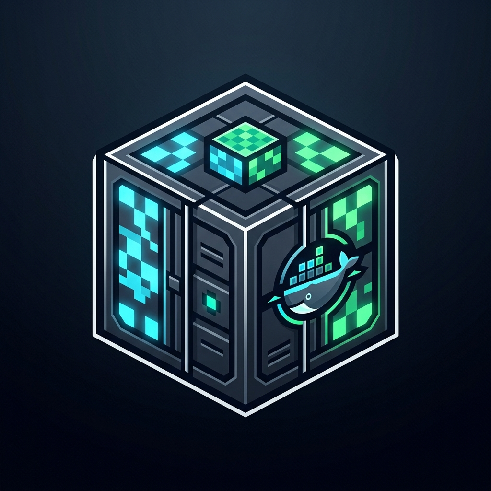

<table>
  <tr>
    <td width="140" align="center" valign="middle">
      
    </td>
    <td valign="middle">
      <h2>🎮 Dockraft — Dedicated Minecraft Server in Docker</h2>
      <p><strong>Panel web ultra-ligero y automatizado para administrar una única instancia dedicada de servidor de Minecraft (Java & Bedrock).</strong></p>
      <p>
        <a href="https://hub.docker.com/r/marcusm99/dockraft"></a>
        <a href="LICENSE"></a>
        <a href="https://fastapi.tiangolo.com"></a>
        <a href="https://gmsec.cc"></a>
        <br />
        
      </p>
    </td>
  </tr>
</table>

<p>
  🌐 <strong>Select Language / Selecciona Idioma:</strong> <a href="#-versión-en-español"><strong>ES Español</strong></a> | <a href="#-english-version"><strong>GB English</strong></a>
</p>

---

## 🇪🇸 Versión en Español

### 💡 ¿Por qué Dockraft? (Arquitectura de Instancia Única)

Los paneles tradicionales para Minecraft como **Crafty Controller** o **Pterodactyl** fueron diseñados para alojar decenas de servidores concurrentes. Por esa razón, requieren bases de datos pesadas (MySQL/PostgreSQL), colas de procesos (Redis/Celery), demonios en segundo plano y múltiples servicios que consumen entre **350 MB y más de 1 GB de memoria RAM en reposo**, incluso antes de encender el juego.

**Dockraft fue diseñado bajo una filosofía intencionalmente distinta: 1 Contenedor = 1 Servidor Dedicado.**

Al enfocarse exclusivamente en mantener y optimizar **una única instancia de servidor por contenedor**:
* **No requiere bases de datos externas**: Todas las opciones y configuraciones se gestionan limpiamente en archivos JSON locales.
* **No tiene intermediarios pesados**: El panel corre en un único proceso asíncrono en Python con FastAPI y Uvicorn.
* **Aprovechamiento máximo del hardware**: En un VPS o servidor con 2 GB, 4 GB u 8 GB de memoria, Dockraft apenas consume unos pocos megabytes. **Más del 98% de tu memoria RAM y CPU queda 100% disponible para el juego, tus mundos, mods y jugadores.**

---

### 📊 Comparativa de Consumo Real de Memoria RAM (Prueba Empírica)

| Panel de Control | Consumo en Reposo (Idle) | Tiempo de Arranque | Enfoque de Servidores |
| :--- | :---: | :---: | :--- |
| **Dockraft** | **~4.5 MB a 45 MB** | **~1 segundo** | **Instancia única dedicada (ultra-ligero y optimizado)** |
| Crafty Controller v4 | ~350 MB a 700 MB | ~20 a 30 segundos | Multi-servidor pesado (Tornado, Flask, SQLite/Postgres) |
| Pterodactyl Panel | ~800 MB a 1.2 GB | Múltiples servicios | Infraestructura distribuida (PHP, Nginx, DB, Redis, Wings) |

---

### ✨ Características Principales

* 🕹️ **Instalador en 1 Clic**: Elige el tipo de servidor y la versión; Dockraft descarga los binarios oficiales, acepta el EULA automáticamente y configura los puertos y archivos iniciales:
  * **PaperMC**: Rápido y optimizado. El más recomendado para jugar con amigos y usar plugins.
  * **Purpur**: Variante de Paper con máxima personalización y gran rendimiento.
  * **Mojang Vanilla**: El Minecraft clásico original, sin añadidos ni plugins.
  * **Fabric**: Ligero y rápido para jugar con mods modernos.
  * **Minecraft Forge**: El sistema tradicional y con mayor catálogo de mods.
  * **Bedrock Dedicated**: Para jugar desde celulares, consolas (Xbox, PlayStation, Switch) y Windows.
  * **Importar Servidor (.zip)**: Migra cualquier servidor previo subiendo un archivo comprimido.
* 📟 **Consola en Vivo**: Transmisión de registros en tiempo real, envío de comandos con respuesta instantánea, historial con flechas del teclado y botones de comandos frecuentes.
* 💾 **Respaldos Selectivos**: Elige si respaldar todo el servidor o únicamente carpetas clave (como los mundos o los plugins) para ahorrar espacio en disco.
* ⏰ **Tareas Programadas**: Automatiza reinicios periódicos, encendido/apagado o copias de seguridad usando intervalos de tiempo o expresiones Cron.
* 🔔 **Notificaciones Webhooks**: Recibe avisos automáticos en tu canal de **Discord**, grupo de **Telegram** o **Correo Electrónico** cuando el servidor inicie, se detenga o concluya una tarea.
* 📁 **Gestor de Archivos Integrado**: Modifica archivos de texto (`server.properties`, `bukkit.yml`), sube archivos o descomprime paquetes `.zip` directamente desde el navegador.
* 🔒 **Seguridad y Control de Acceso**:
  * Autenticación por contraseña de administrador y sesiones seguras firmadas con HMAC.
  * **Protección contra ataques de fuerza bruta**: Bloqueo temporal automático de 10 minutos tras 5 intentos fallidos de inicio de sesión.

---

### 🚀 Despliegue con Docker Compose (Recomendado)

#### Opción 1: Copiar y Pegar (Más rápido, sin clonar repositorio)
Crea una carpeta en tu servidor y un archivo `docker-compose.yml` con el siguiente contenido:

```yaml
services:
  dockraft:
    image: marcusm99/dockraft:latest
    container_name: dockraft
    restart: unless-stopped
    ports:
      - "8000:8000"       # Panel Web
      - "25565:25565"     # Minecraft Java (TCP)
      - "19132:19132/udp" # Minecraft Bedrock (UDP)
    environment:
      - TZ=America/Guayaquil
      - ADMIN_USER=admin
      - ADMIN_PASSWORD=MiContraseñaSegura
      - SECRET_KEY=genera_una_clave_secreta_con_openssl
    volumes:
      - ./data:/server_data
      - ./backups:/server_backups
```

Luego inicia el contenedor:
```bash
docker compose up -d
```

#### Opción 2: Clonando el repositorio oficial
1. Clona el repositorio:
   ```bash
   git clone https://github.com/GMS-EC/dockraft.git
   cd dockraft
   ```

2. (Opcional) Configura tus credenciales en un archivo `.env`:
   ```bash
   cp .env.example .env
   ```

3. Inicia el servidor:
   ```bash
   docker compose up -d
   ```

El panel estará disponible de inmediato en **`http://localhost:8000`** (o en la IP pública de tu servidor).

---

### 🐳 Despliegue con Docker Run Directo

```bash
docker run -d \
  --name dockraft \
  -p 8000:8000 \
  -p 25565:25565 \
  -p 19132:19132/udp \
  -v ./data:/server_data \
  -v ./backups:/server_backups \
  -e ADMIN_USER=admin \
  -e ADMIN_PASSWORD=MiContraseñaSegura \
  -e TZ=America/Guayaquil \
  --restart unless-stopped \
  marcusm99/dockraft:latest
```

---

### ⚙️ Variables de Entorno

| Variable | Valor por Defecto | Descripción |
| :--- | :---: | :--- |
| `PORT` | `8000` | Puerto web de acceso al panel. |
| `ADMIN_USER` | `admin` | Nombre de usuario de inicio de sesión. |
| `ADMIN_PASSWORD` | *(vacío)* | Contraseña del panel. Si se deja vacía, no se solicita inicio de sesión. |
| `SECRET_KEY` | *(aleatoria)* | Clave para firmar sesiones criptográficas HMAC. |
| `TZ` | `America/Guayaquil` | Zona horaria del servidor para tareas programadas y respaldos. |
| `LOGIN_MAX_ATTEMPTS` | `5` | Intentos fallidos permitidos antes de aplicar rate limiting. |
| `LOGIN_COOLDOWN_SECONDS` | `600` | Segundos de enfriamiento y bloqueo tras superar el límite de intentos (10 min). |

---

### 📂 Volúmenes Persistentes

* **`/server_data`**: Aloja el servidor activo (mundos, plugins, mods, configuraciones y logs).
* **`/server_backups`**: Carpeta aislada donde se guardan las copias de seguridad `.zip`.

---

### 🧪 Pruebas Automatizadas

```bash
pytest tests/ -v
```

---

<br />

---

## 🇬🇧 English Version

### 💡 Why Dockraft? (Single-Instance Dedicated Architecture)

Traditional Minecraft control panels like **Crafty Controller** or **Pterodactyl** were architected to host dozens of game servers simultaneously. Because of this, they bundle heavy relational databases (MySQL/PostgreSQL), background worker queues (Redis/Celery), and multiple background daemons that consume between **350 MB and over 1 GB of idle RAM** before any game is even started.

**Dockraft was purposefully built under a different philosophy: 1 Container = 1 Dedicated Server.**

By focusing strictly on managing and optimizing **a single server instance per container**:
* **No external databases required**: All settings and state are stored cleanly in lightweight local JSON files.
* **No bloated middleware**: Runs as a single asynchronous Python process powered by FastAPI and Uvicorn.
* **Maximum hardware efficiency**: On a 2 GB, 4 GB, or 8 GB VPS, Dockraft uses almost zero resources. **More than 98% of your CPU and RAM is 100% dedicated to Minecraft, your worlds, mods, and players.**

---

### 📊 Real RAM Consumption Benchmark

| Panel | Idle RAM Usage | Startup Time | Multi-server Model |
| :--- | :---: | :---: | :--- |
| **Dockraft** | **~4.5 MB to 45 MB** | **~1 second** | **Single dedicated instance (ultra-lightweight & focused)** |
| Crafty Controller v4 | ~350 MB to 700 MB | ~20 to 30 seconds | Heavy multi-instance stack (Tornado, Flask, SQLite/Postgres) |
| Pterodactyl Panel | ~800 MB to 1.2 GB | Multiple services | Distributed infrastructure (PHP, Nginx, DB, Redis, Wings) |

---

### ✨ Key Features

* 🕹️ **1-Click Server Installer**: Select your desired engine and Minecraft version; Dockraft downloads official builds, automatically accepts the Mojang EULA, and generates initial configuration files:
  * **PaperMC**: Fast and optimized. The top choice for playing with friends and plugins.
  * **Purpur**: Enhanced Paper fork with high performance and deep gameplay customization.
  * **Mojang Vanilla**: Pure, unmodified official Minecraft server.
  * **Fabric**: Lightweight and fast for modern modpacks.
  * **Minecraft Forge**: The classic, battle-tested modding ecosystem.
  * **Bedrock Dedicated**: For mobile devices, consoles (Xbox, PlayStation, Switch), and Windows.
  * **Import Server (.zip)**: Easily migrate any existing server by uploading a `.zip` archive.
* 📟 **Live Web Console**: Real-time log streaming, instant command input, keyboard arrow command history, and quick-action buttons.
* 💾 **Selective Backups**: Choose whether to back up the entire server or just crucial directories (such as worlds or plugins) to save storage space.
* ⏰ **Automated Scheduled Tasks**: Schedule automated restarts, power on/off times, or recurring backups using custom intervals or Cron expressions.
* 🔔 **Webhook Alerts**: Receive automatic notifications in your **Discord** channel, **Telegram** group, or **Email** when the server starts, stops, or finishes a scheduled task.
* 📁 **Built-in Web File Manager**: Browse server directories, edit configuration files (`server.properties`, `bukkit.yml`) right in your browser, upload files, or extract `.zip` archives safely.
* 🔒 **Security & Access Control**:
  * Password authentication with tamper-proof HMAC session cookies.
  * **Brute-force protection**: Automatic 10-minute cooldown lockout after 5 consecutive failed login attempts.

---

### 🚀 Quick Start with Docker Compose (Recommended)

#### Option 1: Copy & Paste (Fastest, no git clone needed)
Create a new directory and save the following as `docker-compose.yml`:

```yaml
services:
  dockraft:
    image: marcusm99/dockraft:latest
    container_name: dockraft
    restart: unless-stopped
    ports:
      - "8000:8000"       # Web Panel
      - "25565:25565"     # Minecraft Java (TCP)
      - "19132:19132/udp" # Minecraft Bedrock (UDP)
    environment:
      - TZ=America/Guayaquil
      - ADMIN_USER=admin
      - ADMIN_PASSWORD=MySecurePassword
      - SECRET_KEY=generate_a_secret_key_with_openssl
    volumes:
      - ./data:/server_data
      - ./backups:/server_backups
```

Then launch the container:
```bash
docker compose up -d
```

#### Option 2: Clone the Repository
1. Clone the repository:
   ```bash
   git clone https://github.com/GMS-EC/dockraft.git
   cd dockraft
   ```

2. (Optional) Configure your environment variables:
   ```bash
   cp .env.example .env
   ```

3. Launch Dockraft:
   ```bash
   docker compose up -d
   ```

Open your browser at **`http://localhost:8000`** (or your server's public IP).

---

### 🐳 Run Directly with Docker

```bash
docker run -d \
  --name dockraft \
  -p 8000:8000 \
  -p 25565:25565 \
  -p 19132:19132/udp \
  -v ./data:/server_data \
  -v ./backups:/server_backups \
  -e ADMIN_USER=admin \
  -e ADMIN_PASSWORD=MySecurePassword \
  -e TZ=America/Guayaquil \
  --restart unless-stopped \
  marcusm99/dockraft:latest
```

---

### ⚙️ Environment Variables

| Variable | Default Value | Description |
| :--- | :---: | :--- |
| `PORT` | `8000` | Web panel port. |
| `ADMIN_USER` | `admin` | Administrator username for login. |
| `ADMIN_PASSWORD` | *(empty)* | Web panel password. If empty, authentication is disabled (suitable for local testing). |
| `SECRET_KEY` | *(random)* | Cryptographic key used to sign HMAC session tokens. |
| `TZ` | `America/Guayaquil` | Server timezone for scheduled tasks and backup timestamps. |
| `LOGIN_MAX_ATTEMPTS` | `5` | Maximum failed login attempts allowed before IP cooldown. |
| `LOGIN_COOLDOWN_SECONDS` | `600` | Duration of lockout in seconds (10 minutes). |

---

### 📂 Storage Volumes

* **`/server_data`**: Holds the active Minecraft server (worlds, plugins, mods, configs, and logs).
* **`/server_backups`**: Isolated directory storing compressed `.zip` backup archives.

---

### 🧪 Automated Testing

```bash
pytest tests/ -v
```

---

## 📄 License

Distributed under the **GNU General Public License v3.0 (GPLv3)**. See [`LICENSE`](LICENSE) for details.

Developed with care by [**GMS-EC**](https://gmsec.cc).
